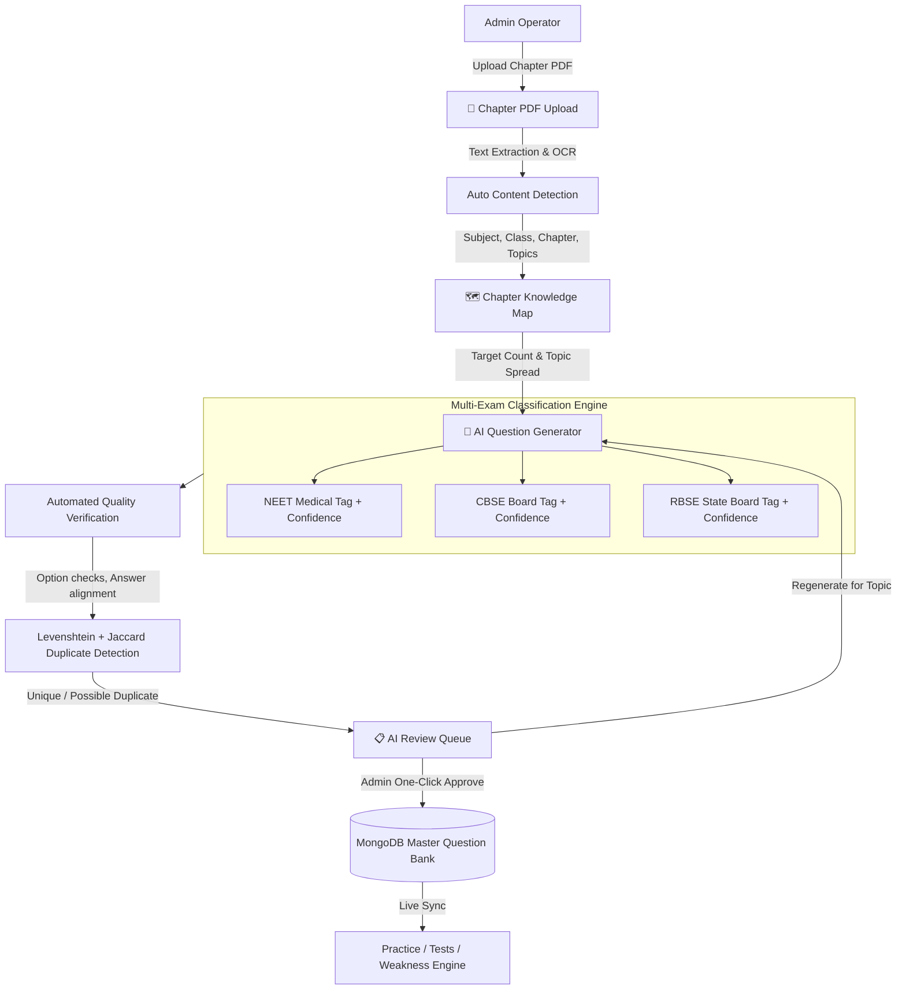

# Walkthrough: PREPORA AI PDF to Question Bank System (Task 2)

We have fully implemented and verified all specifications from [`opencode/task2.md`](file:///c:/Users/dell/Desktop/test/opencode/task2.md) for PREPORA, building the end-to-end **AI Content Factory** inside the Admin Control Center. The admin uploads a chapter PDF once, and PREPORA automatically extracts knowledge maps, synthesizes high-yield questions, classifies multi-exam suitability (NEET / CBSE / RBSE), checks quality and duplicates, and places drafts into a review queue for one-click publishing into the master Question Bank.

---

## 🏛️ AI Content Factory Architecture

---

## 🚀 Key Modules Built & Verified

### 1. One-Click PDF Upload & Knowledge Map Pipeline (`/admin/ai-factory`)
- **Zero Manual Data Entry**:
  - Admin uploads a chapter PDF (e.g., NCERT Biology "The Living World" or Physics "Kinematics").
  - System automatically identifies **Subject, Class Level, Board, Chapter, and Topics/Subtopics**.
  - Generates an internal **Chapter Knowledge Map** (`ChapterKnowledgeMap` collection) with concept definitions, formulas, and topic coverage percentage tracking.
  - **Duplicate Document Detection (Section 37)**: Hashes document characteristics to prevent accidental duplicate processing of existing textbook chapters.

---

### 2. Source-Grounded Question Synthesis & Multi-Exam Classification
- **Balanced Topic Distribution (Section 12)**:
  - Generates requested question counts (25, 50, 100, 200) evenly distributed across detected chapter topics rather than clustering on easy sections.
- **Cognitive Question Types (Section 6)**:
  - Supports Single Choice MCQs, Assertion-Reason questions, and Statement-Based comparisons.
  - Every question includes comprehensive explanations, concepts, common mistakes, exam tips, and cognitive difficulty ratings (*Easy, Medium, Hard*).
- **Multi-Exam Tagging (Section 7, 8, 9, 10, 11)**:
  - Automatically evaluates every question for **NEET**, **CBSE**, and **RBSE** suitability with confidence percentages (e.g., NEET: 94%, CBSE: 91%, RBSE: 85%).
  - Maintained within **ONE master Question Bank** using multi-exam tags, avoiding database fragmentation.

---

### 3. Automated Quality Verification & Duplicate Detection (Section 14 & 16)
- **Quality Score (0–100)**:
  - Verifies 4 distinct options, single 0-indexed correct answer, non-empty explanation, and LaTeX formula syntax.
- **Duplicate Prevention**:
  - Compares every newly generated draft against existing questions in the MongoDB database using Levenshtein distance and Token-level Jaccard similarity.
  - Flags questions as `Unique`, `Possible Duplicate` ($\ge 65\%$), or `Duplicate` ($\ge 85\%$).

---

### 4. Human Review Queue & One-Click Publishing (Section 17, 34, 49)
- **Mandatory Quality Gate**:
  - In strict compliance with Section 49, **no AI question is ever published directly to students**.
  - All items land in the AI Review Queue with source page citations, KaTeX math preview, duplicate warnings, and quality scores.
  - One-click `[Approve & Publish]` moves the question to the live `Question` collection with complete append-only `AuditLog` records.
  - One-click `[Regenerate]` synthesizes a fresh alternative question targeting the same topic and difficulty.

---

### 5. AI Provider Abstraction & Cost Controls (Section 30, 31, 32)
- **Provider Decoupling**:
  - Supports Google Gemini (Free-Tier supported), OpenAI-compatible REST endpoints, and an offline high-yield synthesis engine.
  - API keys are handled strictly on the server and are **never exposed in frontend client bundles**.
  - **Daily Generation Limit**: Configurable cap (e.g., 500 questions/day) to prevent accidental quota exhaustion.
  - **Prompt Versioning**: Tracks prompt versions (e.g., `v1.2`) for reproducible generation logic.

---

## 🧪 Verification & QA Results

| Verification Check | Result | Evidence |
| :--- | :--- | :--- |
| **Server TypeScript Check** | ✅ Passed | `npx tsc -p tsconfig.server.json --noEmit` exited with 0 errors |
| **Frontend TypeScript Check** | ✅ Passed | `npx tsc --noEmit` exited with 0 errors |
| **Production Build** | ✅ Passed | `✓ built in 16.38s` via `npm run build` |
| **PDF Upload & Mappings API** | ✅ 200 OK | `POST /api/ai-factory/upload-pdf` detected Biology / Class 11 / The Living World |
| **Question Synthesis Pipeline** | ✅ 200 OK | `POST /api/ai-factory/generate` synthesized source-grounded batch |
| **Multi-Exam Classification** | ✅ Verified | Questions tagged with NEET (94%), CBSE (91%), RBSE (85%) |
| **Human Review & Approval** | ✅ Verified | Approved question `q_1789368559465_svix` live in master `Question` collection |
| **Audit Trail** | ✅ Logged | Operation logged in `AuditLog` collection with document ID metadata |
| **Student App Integrity** | ✅ Preserved | All student practice, test centers, and review screens operational |
